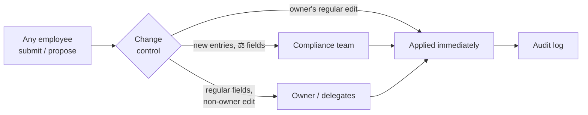

# compliventory
{: .fs-9 }

The company's vendors and systems, accounted for.
{: .fs-6 .fw-300 }

[Get started](getting-started.md){: .btn .btn-primary .mr-2 }
[How it works](how-it-works.md){: .btn }

---

## The problem

Every company runs on third parties and internal systems — Slack, AWS, the HR portal, that
CRM nobody remembers buying. Someone has to know **what is in use, who is accountable for
it, where the data lives, and how risky it is** — for security reviews, for GDPR records
of processing, for the auditor who asks "show me your vendor register". Spreadsheets go
stale the week they're written.

## What compliventory does

compliventory is a self-hosted **inventory of vendors and systems** that stays current
because keeping it current is cheap:

- **Any employee** can submit a new vendor/system or propose an edit — no gatekeeping at
  the door.
- **Change control** routes every change to the right reviewer: new entries and
  compliance-gated (⚖) fields go to the **compliance team**; regular edits by non-owners
  go to the **asset's owner**; owner/delegate edits apply immediately.
- **Vendor risk assessments** — compliance reviews a vendor against an evidence checklist;
  inherent risk is computed from the inventory, residual risk is the review's outcome, and
  the next review date drives an overdue queue and a weekly digest.
- **Everything is audited** — who, what, when, the diff, and the justification, in an
  append-only log.

It is the companion product to
[governauthzer](https://github.com/governauthzer/governauthzer): compliventory owns the
**asset catalog** (what exists, who owns it, how sensitive it is), governauthzer owns
**access decisions**. Deliberately a separate product, not a module.

> **Early stage.** The inventory and vendor risk assessment are feature-complete; GDPR
> RoPA (Art. 30) records are planned on top of them.

## Start here

- **New here?** Read **[How it works](how-it-works.md)**, then
  **[Getting started](getting-started.md)** to click through the whole
  submit → review → approve loop locally in a few minutes.
- **Operating it?** The **[Admin guide](admin-guide.md)** covers roles, user sync, and
  API tokens.
- **Integrating?** The **[Users sync API](api.md)** and **[Deployment](deployment.md)**.
