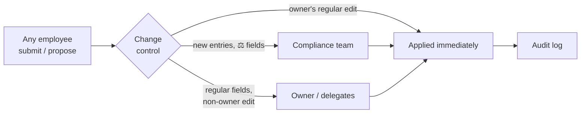

# compliventory
{: .fs-9 }

The company's vendors and systems, accounted for.
{: .fs-6 .fw-300 }

[Get started](getting-started.md){: .btn .btn-primary .mr-2 }
[How it works](how-it-works.md){: .btn }

---

## What it does

compliventory is a self-hosted **inventory of vendors and systems** — what the company
uses, who is accountable for it, where the data lives, and how risky it is:

- **Any employee** can submit a new vendor/system or propose an edit — no gatekeeping at
  the door.
- **Change control** routes every change to the right reviewer: new entries and
  compliance-gated (⚖) fields go to the **compliance team**; regular edits by non-owners
  go to the **asset's owner**; owner/delegate edits apply immediately.
- **Vendor risk assessments** — compliance reviews a vendor against an evidence checklist;
  inherent risk is computed from the inventory, residual risk is the review's outcome, and
  the next review date drives an overdue queue and a weekly digest.
- **Everything is audited** — who, what, when, the diff, and the justification, in an
  append-only log.

```mermaid
flowchart LR
  E["Any employee<br/>submit / propose"] --> CC{"Change<br/>control"}
  CC -->|"new entries, ⚖ fields"| C["Compliance team"]
  CC -->|"regular fields,<br/>non-owner edit"| O["Owner / delegates"]
  CC -->|"owner's regular edit"| A["Applied immediately"]
  C --> A
  O --> A
  A --> L["Audit log"]
```

It is the companion product to
[governauthzer](https://github.com/governauthzer/governauthzer): compliventory owns the
**asset catalog** (what exists, who owns it, how sensitive it is), governauthzer owns
**access decisions**. Deliberately a separate product, not a module.

> **Early stage.** The inventory and vendor risk assessment are feature-complete; GDPR
> RoPA (Art. 30) records are planned on top of them.

## Start here

- **[How it works](how-it-works.md)** — the objects, the review lanes, the audit log.
- **[Getting started](getting-started.md)** — run it locally in a few minutes.
- **[Admin guide](admin-guide.md)** · **[Users sync API](api.md)** ·
  **[Deployment](deployment.md)** — operating and integrating it.
